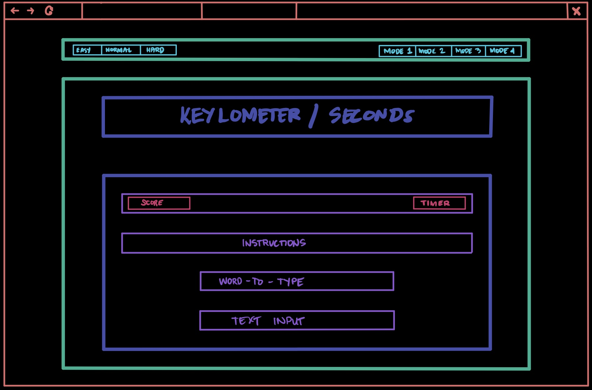

# SEI-0124 Project 1: Speed-typer: Keylometers/Second
## IDEA
For my first project in this course, I decided to build my version of a speed typing challenge. As a novice mechanical keyboard enthusiast, I enjoy building keyboards using different switches depending on what sound profile and feel I am looking for at certain times. And to test out the build, I always use websites like [monkeytype](https://www.monkeytype.com/) and [kbsim](https://kbs.im/).

## TECH STACK TO BE USED:
> I plan on using HTML, CSS, Bootstrap/Other CSS Frameworks, Favicon, and Javascript

## TECHNICAL OVERVIEW
The words to be typed will be displayed one by one. Once the user types the word correctly, a new word will be generated (no need to press enter), and the score will be incremented by one. I will also implement a count down timer that will be incremented whenever the player types in the word correctly.

## Levels of Difficulty Explained:
MVP will only have Normal difficulty as default. Once the MVP goal has been reached, I will be adding more levels into the game. 

### Every word typed correctly will increment the timer by: 

#### EASY MODE
+ 5 seconds.

#### NORMAL MODE(DEFAULT)
+3 Seconds

#### HARD MODE
+ 2 seconds.

## WIREFRAME

## MVP

1. Presentable and responsive design
2. 1 Level of Difficulty (NORMAL)
3. Randomly generate words and display using DOM Manipulation.
4. Increment Score and Timer when words match.
5. Reset button that resets the timer and input fields.
6. Timer increment depending on difficulty.
7. Game over function.
8. Start Button

## Stretch Goals Achieved:

1. Add Easy mode and Hard Mode.
2. + 5 seconds for easy mode, + 3 for normal mode, + 2 for hard mode.
3. Add sound effects
4. Add mute button
5. Add home page.
6. Add re-do Button

### SOURCES
All images used are from google images.
All audios used are from ZapSplat.com
<!-- ## PROJECT TIMELINE
#### This is only a guide. For accountability. 
2/4/22 - Barebones Finished. HTML, CSS, Bootstrap
2/7/22 - First commit. Functions first half finished.
2/8/22 - Functions, second half. DOM Manipulation and display.**50% Finished**.
2/9/22 - MVP Finished and bug-free. Start working on Stretch goals one by one.
2/10/22 - Final debugging. Make script for smoother presentation.
2/11/22 - D-Day. -->

